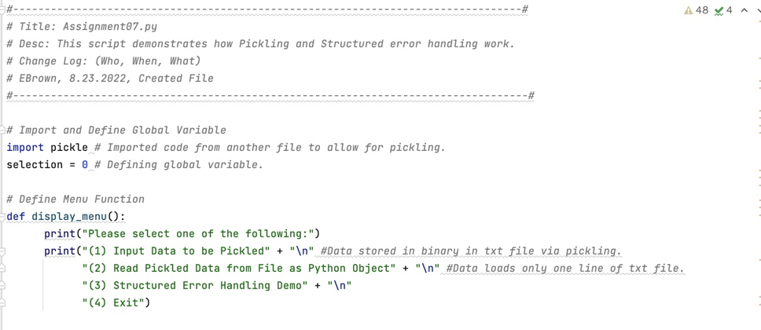
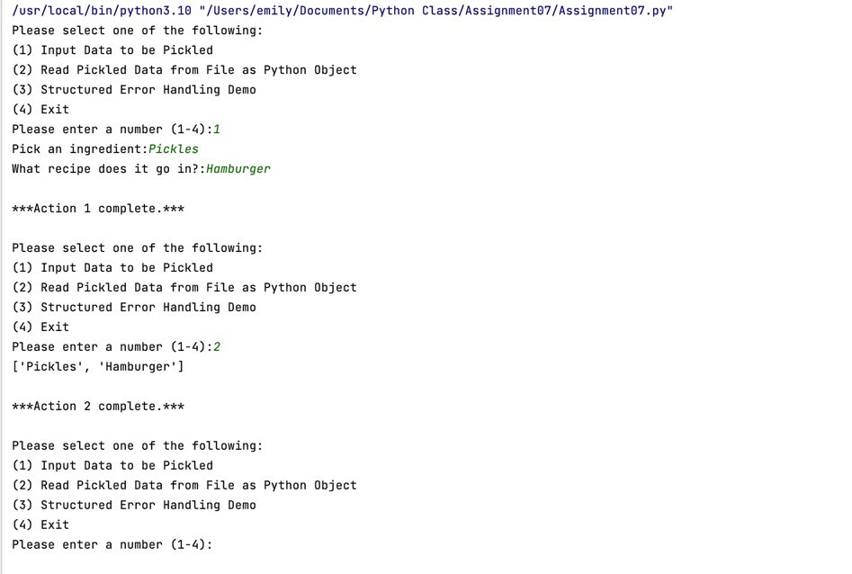

# IntroToProg-Python-Mod07
This repository is for Module07 of Intro to Programming - Python.

# Introduction
The purpose of Assignment 07 is to demonstrate how Pickling and Structured Error Handling work. I created this script in PyCharm and utilized PyCharm and Terminal to ensure it runs properly. Please see references for resources I used in my research. I am working on a Mac OS.

# Strategy
I utilized a similar structure to our recent assignments that allows the user to input their selection out of four menu options. The options are to input data to be pickled, load and print data that has been pickled and saved in a text file, initiate a demo of structured error handling, or exit the program.

# Script
Below are screenshots from PyCharm of the script for Assignment 07. The first section of code is the change log, declaration of global variables, and definition of the menu function. Note that I have imported “pickle” to allow for the pickling functions to be used.

*Figure 1: Header, Global Variables, and Menu Function*

Below is the first portion of the Main Script, which includes the demo of pickling data, writing it to a text file, then loading that data back into a Python Object. Note that the file is cleared each time new data is entered because the “pickle.load()” function can only read one line of data.

*Figure 2: First Portion of Main Script - Pickling Demo*

The Structured Error Handling Demo and Code Exit are in the second portion of the Main Script.

Insert Image
*Figure 3: Second Portion of Main Script – Structured Error Handling*

# Results
Below are screenshots of how the code presents itself when it is run in PyCharm.

First, I chose option 1 to demonstrate pickling. I entered “Pickles” and “Hamburger” into the list “new_item.” This data was then converted to binary and saved into the file “GroceryList.txt”. Once I selected option 2, Pickles and Hamburger are displayed in list form after being converted back from binary to a Python Object.

See below for the user interface for options 1 and 2.

Insert image
*Figure 4: User Interface – Options 1 and 2*

It is also worth noting the characters stored in GroceryList.txt. While it does not present as binary, it also does not present as normal text.

Insert image
*Figure 5: User Inputted Data Stored in Text File*

Next, I selected option 3 to demonstrate Structured Error Handling. The user interface show very little, but there are notes within the script (see Figure 3) to guide the user through the demo. Note that the first Try and Except statement contains no error, so the script runs and does not divert to indicate an error. However, the second Try and Except statement contains an error so it diverts to indicate an error in that section of code. Finally, I selected option 4 to exit the code.

See below for the user interface for options 3 and 4.

Insert image
*Figure 6: User Interface - Options 3 and 4*

Finally, see below for the user interface for this code in Terminal

Insert image
*Figure 7: User Interface - Terminal*

# Summary
In summary, the Python script successfully achieves the objective of the assignment. It runs in both PyCharm and Terminal with the same results and demonstrates both pickling and structured error handling.

# Resources

Understanding Python Pickling with Examples:
https://www.geeksforgeeks.org/understanding-python-pickling-example/

Read a Pickle File in Python:
https://www.delftstack.com/howto/python/python-read-pickle/

Text Files vs. Binary Files: https://fileinfo.com/help/binary_vs_text_files#:~:text=While%20both%20binary%20and%20text,textual%20and%20custom%20binary%20data.

